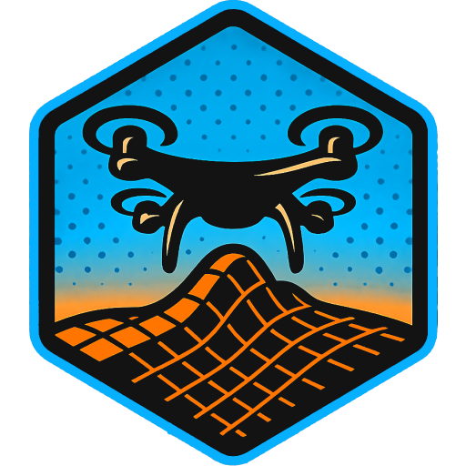

  

<h1 align="center">
  Flight ReLive
</h1>

**Flight Relive** is an open-source project designed to bring your drone flight videos to life in an immersive way.  
The application processes your recorded flights and provides a new perspective to relive them.

This project is fully **open source**, released under the **AGPL-3.0 license**, and built using **Unity 6000.2.01f**.

  

## 💻 About the Project

Flight Relive allows drone pilots to import and replay their flight videos in a unique and interactive manner.  
The project aims to provide compatibility with a wide range of drones and video formats.  

We are actively seeking **user feedback** to improve:

- **Drone compatibility** (please let us know if your drone works properly or if you encounter issues).  
- **The general user experience** of the application.  

Your input is invaluable to help the project grow and evolve!  

## ✅ Compatibility

| Drone               | Compatibility |
|---------------------|---------------|
| DJI Mini 2 SE       | 🟢 OK         |
| DJI Mini 4K         | 🟢 OK         |
| DJI Flip            | 🟡 NOT TESTED |
| DJI Neo             | 🟡 NOT TESTED |
| DJI Mini 3          | 🟡 NOT TESTED |
| DJI Mini 3 Pro      | 🟡 NOT TESTED |
| DJI Mini 4 Pro      | 🟢 OK         |
| DJI Air 3           | 🟡 NOT TESTED |
| DJI Air 3S          | 🟡 NOT TESTED |
| DJI Mavic 3 Classic | 🟡 NOT TESTED |
| DJI Mavic 3 Pro     | 🟡 NOT TESTED |
| DJI Mavic 4 Pro     | 🟡 NOT TESTED |

## 🛠️ Getting Help

If you experience compatibility issues, please send:  

- Your **video file**,  
- The corresponding **SRT file** (if available),  

to: **flightrelive@gmail.com**  
and/or create a **GitHub Issue** directly on this repository.  

## 🌍 Useful Links

- 🌐 **Official Website**: [www.flight-relive.org](http://www.flight-relive.org)  
- 💬 **Support & Issues**: [GitHub Issues](../../issues)  
- 💖 **Support the project on Tipeee**: [https://fr.tipeee.com/flight-relive](https://fr.tipeee.com/flight-relive)  

## 📦 Third Party

Behind Flight ReLive’s immersive experience are these outstanding third-party libraries and tools.
The incredible work of their developers enables the features and performance that make this project possible — without them, Flight ReLive could not exist.

  
| Name              | Description |
|------------------|--------------------------------------------------|
| [Fugui](https://github.com/Keksls/fugui) | An immediate-mode GUI framework for Unity, inspired by ImGui, enabling fast and flexible user interfaces.|
| [FFmpeg](https://ffmpeg.org/) | A comprehensive, cross-platform solution for recording, converting, and streaming audio and video.|
| [Clipper2Lib](https://github.com/AngusJohnson/Clipper2) | A library for polygon clipping and offsetting operations, supporting C++, C#, and Delphi.|
| [LibTessDotNet](https://github.com/speps/LibTessDotNet) | A C# port of the GLU Tessellator, providing robust and fast tessellation and triangulation for .NET applications.|
| [Vector-tile-cs](https://github.com/mapbox/vector-tile-cs) | A C# library for decoding Mapbox Vector Tiles v2.x, facilitating efficient map rendering and manipulation.|
| [Unity.webp](https://github.com/netpyoung/unity.webp) | A Unity package for WebP image format support, allowing for efficient image compression and rendering within Unity projects.|

## 📜 License

This project is licensed under the terms of the **GNU Affero General Public License v3.0 (AGPL-3.0)**.  
See the [LICENSE](./LICENSE) file for details.  

  

